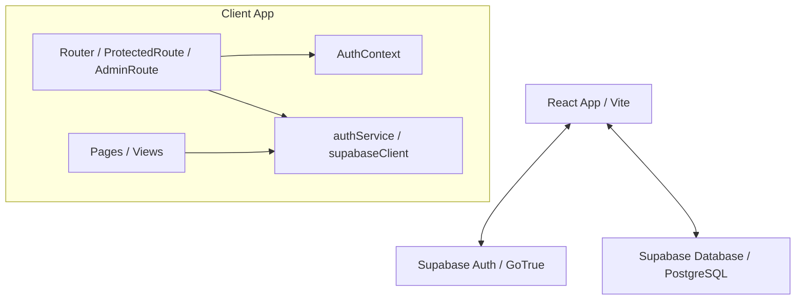

# Especificação Arquitetural - Sinto Muito (Muito Pouco)

Este documento detalha as decisões técnicas, organização de arquivos e arquitetura de fluxo de dados.

---

## 1. Visão Geral da Arquitetura

O projeto adota uma arquitetura de aplicação de página única (SPA) cliente-servidor, consumindo os serviços gerenciados do **Supabase** diretamente do frontend.

---

## 2. Separação de Responsabilidades (Frontend)

Para assegurar manutenibilidade, a infraestrutura separa estritamente as obrigações:

1. **Cliente Supabase (`src/services/supabaseClient.ts`):** Instancia única do SDK `@supabase/supabase-js`, tipada com o esquema do banco de dados.
2. **Serviços (`src/services/authService.ts`):** Camada de dados responsável por interagir diretamente com a API do Supabase (operações de Sign In, Sign Up, consultas e updates nas tabelas `profiles` e `user_roles`).
3. **Contexto de Autenticação (`src/contexts/AuthContext.tsx`):** Registra e sincroniza a sessão e dados diretos do usuário autenticado no Supabase. **Não** armazena dados de regras de negócio, tabelas auxiliares de perfil ou permissões RBAC.
4. **Guarda de Rotas (`src/routes/`):**
   - `ProtectedRoute`: Bloqueia o acesso a rotas privadas caso a sessão do usuário no `AuthContext` esteja vazia.
   - `AdminRoute`: Bloqueia o acesso a rotas administrativas consultando assincronamente na base de dados (via `authService`) se o usuário autenticado possui a role `admin`.
5. **Painel de Diagnóstico (`src/pages/Health.tsx`):** Rota de monitoramento que verifica a integridade de variáveis locais, conexão ativa com a Rest API, autenticação e roles de banco.

---

## 3. Estrutura de Banco de Dados

A arquitetura do banco de dados no Supabase conta com três tabelas essenciais organizadas via migrations SQL em `supabase/migrations/`:

- **`public.profiles`:** Armazena detalhes de perfis de usuário, tendo uma chave estrangeira direta (`id`) apontando para `auth.users(id)`. Sua criação e manipulação ocorrem de forma manual ou administrativa sem o uso de triggers.
- **`public.roles`:** Tabela contendo os nomes dos privilégios de acesso.
- **`public.user_roles`:** Tabela associativa (muitos-para-muitos) ligando usuários a seus papéis na plataforma.

A segurança é reforçada em nível de linha (Row Level Security) e pela função `is_admin()`, que encapsula consultas a roles de forma segura usando o modificador `SECURITY DEFINER`.

---

## 4. Convenções Estruturais de Banco de Dados

Todas as novas tabelas de domínio criadas no projeto seguem rigorosamente as seguintes convenções:
- **Chave Primária (PK):** Tipo `UUID` gerada automaticamente via `gen_random_uuid()`.
- **Campos de Auditoria:** `created_at` e `updated_at` do tipo `timestamptz` preenchidos por padrão no banco.
- **Suporte a Soft Delete:** Coluna `deleted_at` do tipo `timestamptz` (com índice `idx_<tabela>_deleted_at` para otimização de consultas de filtragem).
- **Padronização Visual:** Nomenclaturas em `snake_case`.
- **Constraints Padronizadas:**
  - Chaves estrangeiras nomeadas como `fk_<tabela>_<coluna>`.
  - Constraints exclusivas nomeadas como `uq_<tabela>_<coluna>`.
- **Índices Padronizados:** Nomeados como `idx_<tabela>_<coluna>`.

---

## 5. Políticas de Row Level Security (RLS)

A tabela abaixo descreve as regras de segurança aplicadas às novas entidades de domínio:

| Tabela | Política | SELECT (Leitura) | INSERT (Escrita) | UPDATE (Atualização) | DELETE (Exclusão) |
|---|---|---|---|---|---|
| `ai_models` | "Permitir para autenticados / admin" | Usuários autenticados (apenas ativos) | Apenas Admin | Apenas Admin | Apenas Admin |
| `ai_settings` | "Permitir para autenticados / admin" | Usuários autenticados (apenas ativos) | Apenas Admin | Apenas Admin | Apenas Admin |
| `excuse_tones` | "Permitir para autenticados / admin" | Usuários autenticados (apenas ativos) | Apenas Admin | Apenas Admin | Apenas Admin |
| `prompt_templates` | "Permitir para autenticados / admin" | Usuários autenticados (apenas ativos) | Apenas Admin | Apenas Admin | Apenas Admin |
| `application_settings` | "Permitir para autenticados / admin" | Usuários autenticados (apenas ativos) | Apenas Admin | Apenas Admin | Apenas Admin |
| `excuses` | "Permitir para próprio criador / admin" | Próprio Usuário ou Admin | Próprio Usuário ou Admin | Próprio Usuário ou Admin | Próprio Usuário ou Admin |
| `audit_logs` | "Leitura para admin / escrita para autenticados" | Apenas Admin | Usuários autenticados (próprio id ou admin) | Bloqueado | Bloqueado |

