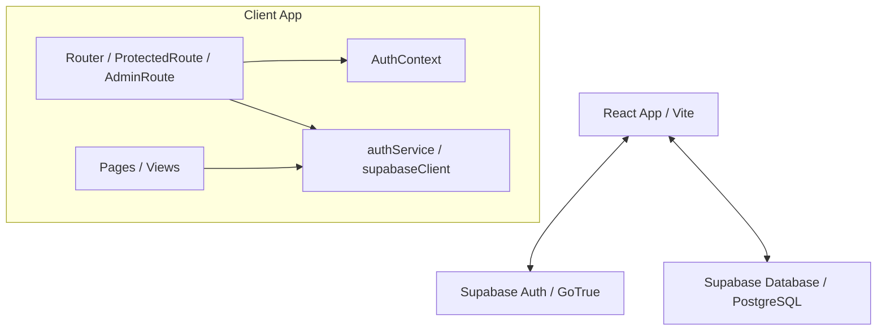

# Especificação Arquitetural - Sinto Muito (Muito Pouco)

Este documento detalha as decisões técnicas, organização de arquivos e arquitetura de fluxo de dados.

---

## 1. Visão Geral da Arquitetura

O projeto adota uma arquitetura de aplicação de página única (SPA) cliente-servidor, consumindo os serviços gerenciados do **Supabase** diretamente do frontend.

---

## 2. Separação de Responsabilidades (Frontend)

Para assegurar manutenibilidade, a infraestrutura separa estritamente as obrigações:

1. **Cliente Supabase (`src/services/supabaseClient.ts`):** Instancia única do SDK `@supabase/supabase-js`, tipada com o esquema do banco de dados.
2. **Serviços (`src/services/authService.ts`):** Camada de dados responsável por interagir diretamente com a API do Supabase (operações de Sign In, Sign Up, consultas e updates nas tabelas `profiles` e `user_roles`).
3. **Contexto de Autenticação (`src/contexts/AuthContext.tsx`):** Registra e sincroniza a sessão e dados diretos do usuário autenticado no Supabase. **Não** armazena dados de regras de negócio, tabelas auxiliares de perfil ou permissões RBAC.
4. **Guarda de Rotas (`src/routes/`):**
   - `ProtectedRoute`: Bloqueia o acesso a rotas privadas caso a sessão do usuário no `AuthContext` esteja vazia.
   - `AdminRoute`: Bloqueia o acesso a rotas administrativas consultando assincronamente na base de dados (via `authService`) se o usuário autenticado possui a role `admin`.

---

## 3. Estrutura de Banco de Dados

A arquitetura do banco de dados no Supabase conta com três tabelas essenciais organizadas via migrations SQL em `supabase/migrations/`:

- **`public.profiles`:** Armazena detalhes de perfis de usuário, tendo uma chave estrangeira direta (`id`) apontando para `auth.users(id)`. Sua criação e manipulação ocorrem de forma manual ou administrativa sem o uso de triggers.
- **`public.roles`:** Tabela contendo os nomes dos privilégios de acesso.
- **`public.user_roles`:** Tabela associativa (muitos-para-muitos) ligando usuários a seus papéis na plataforma.

A segurança é reforçada em nível de linha (Row Level Security) e pela função `is_admin()`, que encapsula consultas a roles de forma segura usando o modificador `SECURITY DEFINER`.
